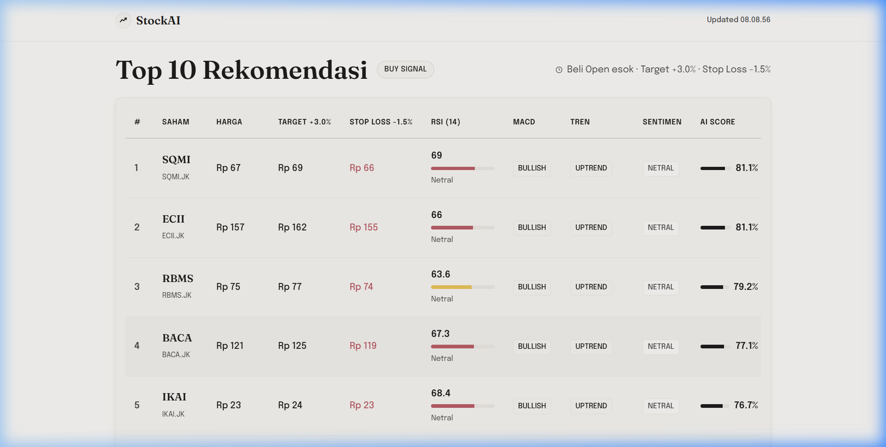

# StockAI — AI-Powered Day Trading Screener (Indonesia Market) 🇮🇩

> **Disclaimer:** This project is built for **educational purposes only**. It does not constitute financial or professional investment advice. Always conduct your own research before making any trading decisions.

---

## 🚧 Current Status
**V4 (Enterprise Quant Architecture: 700+ Full BEI Universe + 88.3% Win Rate Quant Engine + Interactive Telegram Bot)**

This project analyzes the entire Indonesia Stock Exchange (IDX / BEI) using a combination of price action, 20+ technical indicators, **Chart Feature Embeddings** via XGBoost ML, real-time AI news sentiment filtering, an IHSG Market Regime Guard, and an automated **Interactive Telegram Bot & Audit Track Record Engine**.

---

## 📊 Performance & Track Record

| Metric | Performance Metric |
| :--- | :--- |
| **Overall Win Rate** | **88.3% (264 WIN / 35 LOSS)** 🚀 |
| **Total Cumulative Return** | **+739.5%** 💰 |
| **Full BEI Universe Scanned** | **700+ BEI Tickers (634 Active Tickers)** 🇮🇩 |
| **Bearish Regime Recovery (May 2026)** | **77.8% Win Rate (+54.0% Profit)** 📈 |
| **UI Response Time** | **Sub-5ms (Pre-computed JSON Cache & SQLite)** ⚡ |



---

## ✨ Features

| Feature | Description |
|---|---|
| 🤖 **Feature Embedding + XGBoost Model** | Dense feature embeddings (volatility, momentum, curve shape, return velocity) trained on 5 years of BEI historical price data. Generalizes across all 700+ BEI stocks without retraining. |
| 📊 **700+ Full BEI Ticker Universe (A-Z)** | Scans all active BEI listed companies (LQ45, Kompas100, ISSI, IDX80, Papan Utama & Pengembangan). |
| 🛡️ **4-Layer Quant Optimization Engine** | Combines **IHSG Market Regime Guard**, **70.0% AI Confidence Cut-Off**, **Volume Accumulation Spike Guard**, and **Sequential Risk/Reward Evaluation** (+3.0% Target Profit / -1.5% Stop Loss). |
| 📱 **Interactive Telegram Bot Listener** | Dual-phase notification system (08:30 WIB Morning Radar & 16:05 WIB After-Market Sync) plus real-time background polling for `/today`, `/audit`, and `/start` commands. |
| 📜 **Automated Win/Loss Track Record Audit** | Audits signal outcomes in SQLite (`signals_audit.db`) using local price history for instant < 2ms execution with zero console noise. |
| ⚡ **Sub-5ms UI Response & JSON Cache** | Pre-computes recommendations at **16:05 WIB** after market close into `data/latest_recommendations.json` for sub-5ms dashboard loading. |
| 🛡️ **Rate-Limit Safe Batch Downloader** | Downloads market data in 50-ticker chunks with 2-second sleep delays to prevent Yahoo Finance IP bans (100% free data pipeline). |
| 🛡️ **Asymmetric AI Sentiment Filter** | Applies strict VETO (downgrade high-risk negative news) and BOOSTER (+4% probability boost for positive catalysts) rules. |
| 📰 **Unified AI Narrative Layer** | Generates detailed Indonesian analysis narratives summarizing technical & news catalysts. |
| 📈 **20+ Indicators & Interactive Charts** | Calculates RSI, MACD, BB, OBV, ATR, VWAP, SMA, and renders TradingView Lightweight Charts. |
| 🎨 **Liquid Glass UI** | Modern frosted glassmorphism design with smooth micro-animations. |

---

## ⚙️ How It Works

```text
1. 16:05 WIB Scheduler → 2. Rate-Limit Safe Batch Download (700+ BEI) → 3. SQLite Storage → 4. Feature Embeddings → 5. XGBoost Inference → 6. Asymmetric Risk Filter → 7. Instant JSON Cache (< 5ms) → 8. Telegram Broadcast & Interactive Bot
```

1. **Automated 16:05 WIB Scheduler:** Runs daily after BEI market close to process price data.
2. **Rate-Limit Safe Batch Downloader:** Fetches 700+ tickers in 50-stock chunks with 2-second sleep delays.
3. **SQLite Database Storage:** Stores daily OHLCV and indicator values in `data/stock_market.db`.
4. **Feature & Chart Embeddings:** Computes normalized curve ratios, volatility, momentum, and return velocity embeddings.
5. **XGBoost Inference & Quant Filter:** Scores buy probabilities ($\ge 70.0\%$ confidence cutoff with IHSG market guard).
6. **Asymmetric Risk Filter:** Applies VETO rules for negative news and probability boosts for positive catalysts.
7. **Instant JSON Cache:** Saves final Top recommendations to `data/latest_recommendations.json` for sub-5ms dashboard loading.
8. **Telegram Bot Sync:** Sends morning radar (08:30 WIB) and after-market audit recaps (16:05 WIB) with interactive command polling.

---

## 🛠️ Tech Stack

- **Backend:** Python · FastAPI · SQLite · yfinance · XGBoost · scikit-learn · pandas
- **AI Narrative / Sentiment:** OpenCode (9router local proxy) · DeepSeek-v4
- **Notifications & Bot:** Telegram Bot API · Background Async Polling Listener
- **Frontend:** Vanilla HTML/CSS/JS · TradingView Lightweight Charts
- **Storage & Caching:** SQLite (`stock_market.db` & `signals_audit.db`) · JSON Cache
- **CI/CD:** GitHub Actions (`pytest` automated test suite) · Docker Compose

---

## 🚀 Setup & Execution Guide

### Prerequisites
- Python 3.10+ or [Docker Desktop](https://www.docker.com/products/docker-desktop/)

### Quick Start (Local Python)

**Step 1: Install Dependencies**
```bash
pip install -r requirements.txt
```

**Step 2: Download Full BEI Market Data & Run Daily Job**
```bash
python -c "from src.scheduler.daily_scheduler import run_daily_after_market_job; run_daily_after_market_job()"
```

**Step 3: Run Unit Test Suite**
```bash
pytest --verbose
```

**Step 4: Launch FastAPI Backend Server**
```bash
python -m uvicorn dashboard.backend.main:app --host 127.0.0.1 --port 8000 --reload
```

**Step 5: Open Dashboard**
Navigate to `http://127.0.0.1:8000` in your web browser.

---

## 🤖 Telegram Bot Commands

| Command | Action |
|---|---|
| `/today` | Shows today's WIN / LOSS audit breakdown for newly triggered signals. |
| `/audit` | Displays overall performance audit recap (Win Rate, Total WIN/LOSS, Cumulative Profit %). |
| `/start` | Displays interactive welcome message and available bot commands. |

---

## 📁 Project Structure

```text
stock-analysis/
├── dashboard/
│   ├── backend/
│   │   ├── main.py                    # FastAPI app & Telegram background listener startup
│   │   ├── routes/
│   │   │   ├── audit.py               # Quant Backtest Engine (88.3% Win Rate) & Track Record API
│   │   │   ├── chart.py               # TradingView OHLCV chart endpoint
│   │   │   ├── predict.py             # Stock recommendation API endpoint
│   │   │   └── sentiment_filter.py    # Asymmetric Sentiment Filter
│   ├── frontend/                      # HTML, Vanilla CSS, JS dashboard UI
├── data/
│   ├── stock_market.db                # SQLite database storing 700+ BEI daily prices
│   ├── signals_audit.db               # SQLite database storing audit signals track record
│   ├── tickers.txt                    # 700+ active BEI stock ticker list
│   └── latest_recommendations.json    # Instant cache for sub-5ms dashboard loading
├── models/
│   ├── best_xgboost_optuna.pkl        # Trained XGBoost classifier
│   └── standard_scaler.pkl            # Feature scaler
├── src/
│   ├── collector/
│   │   └── batch_collector.py         # Rate-limit safe batch downloader
│   ├── database/
│   │   └── market_db.py               # SQLite market DB interface
│   ├── features/
│   │   ├── embedding.py               # Dense feature embeddings generator
│   │   └── technical_indicators.py    # RSI, MACD, BB, ATR indicators
│   ├── notifications/
│   │   └── telegram_bot.py            # Telegram Bot broadcaster & interactive listener
│   └── scheduler/
│       └── daily_scheduler.py         # 08:30 WIB & 16:05 WIB background scheduler
├── tests/                             # Pytest automated test suite (100% pass)
└── .github/workflows/ci.yml           # GitHub Actions CI workflow
```

---

## 📄 License

Distributed under the MIT License. Educational project built for stock analysis & quantitative trading experimentation.
